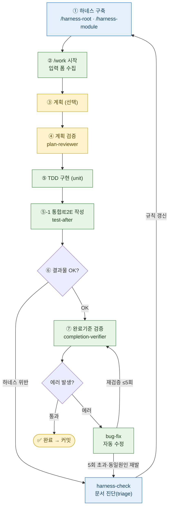

# yeoboya-harness-plugin

앱팀(Android / iOS) 공통 **harness-engineering** 워크플로우 플러그인 V2.
입력 → (계획 → 계획검수) → TDD → 통합/E2E → 검증 → bug-fix 로 이어지는 **닫힌 루프**를 구성하고, 하네스 문서(규칙)로 Claude Code 에 프로젝트 그래프를 제공한다.

## 사전 요구
- **`superpowers` 플러그인 (필수)** — `work` 가 `superpowers:test-driven-development`(TDD) 를 호출한다. 미설치 시 `/work` 의 TDD 단계가 동작하지 않는다.
- **Notion MCP (선택)** — `harness-check` 가 진단을 Notion 에 기록한다. 없으면 `docs/harness-issues/` 로컬 폴백으로 자동 전환된다.

## 구성

### Skills
| 스킬 | 역할 |
|------|------|
| `harness-root` | 루트 문서 8종 초안 생성 |
| `harness-root-edit` | 루트 문서 인자 대상 편집 |
| `harness-module` | leaf 모듈 CLAUDE.md + MODULE_MAP 병렬 생성 |
| `harness-module-edit` | 모듈 CLAUDE.md 인자 대상 갱신 |
| `harness-verify` | root/module 문서 6축 검증 |
| `harness-check` | 산출물↔하네스 불일치 진단 → Notion 기록 |
| `work` | 닫힌 루프 엔진 (입력→(계획→검토)→TDD→통합/E2E→검증) |
| `bug-fix` | 검증 실패 자동 수정 루프 (최대 5회) |

### Sub-agents
| Agent | 역할 |
|------|------|
| `harness-read-write` | 코드 읽고 문서 초안 작성 (sonnet) |
| `harness-doc-verifier` | 문서 6축 검증 (opus, 대상=문서/생성 후) |
| `plan-reviewer` | 계획 7축 검토 (opus, 대상=계획/실행 전) |
| `completion-verifier` | 완료기준 명령 격리 실행·결과 보고 (opus, 대상=확정 완료기준 명령/검증 시점) |

### Hooks
| Hook | 역할 |
|------|------|
| `block-dangerous-command.sh` | 위험 명령 차단 (PreToolUse/Bash) |
| `harness-decay-notify.sh` | 문서 decay 알림 (PostToolUse/Bash) |

### Script
| Script | 역할 |
|------|------|
| `harness-module-gen.js` | `harness-module` 이 호출하는 워크플로우 — 분류→leaf CLAUDE.md 병렬 작성→6축 검증→MODULE_MAP/루트 CLAUDE.md 집계→모듈 간 일관성 검증 격리 실행 |

## 생성 파일

### `harness-root`
| 파일 | 설명 |
|------|------|
| `CLAUDE.md` | 자동 로드 주체 — 자동 적재 `@`참조와 조건부 로딩 규칙을 담는 그릇 |
| `docs/ARCHITECTURE.md` | CLAUDE.md 적재 — 모듈 구조·계층·의존성 방향 |
| `docs/CONVENTIONS.md` | CLAUDE.md 적재 — 코딩 규칙·네이밍·금지 패턴 |
| `docs/SESSION.md` | CLAUDE.md 적재 — 짧은 세션 규칙 목록 |
| `docs/rules/PRD.md` | 조건부(신규 기능 시작 시) — 제품 요구사항 |
| `docs/rules/ADR.md` | 조건부(의존성 매니페스트 편집 시) — 아키텍처 결정 기록 |
| `docs/rules/TESTING.md` | 조건부(test 편집 시) — build/lint/unit/통합/E2E 검증 명령의 단일 출처 |
| `docs/rules/UI_GUIDE.md` (선택) | 조건부(지정 경로 접근 시) — UI/디자인시스템 가이드 |

### `harness-module`
| 파일 | 설명 |
|------|------|
| `{module}/CLAUDE.md` | leaf 모듈별 ≤50줄 — 역할·금지·의존성·암묵규칙 |
| `docs/rules/{module}.md` | 상위 묶음 모듈 rule — 계층 경계·의존성 방향·절대 금지 |
| `docs/MODULE_MAP.md` | 전체 모듈 인덱스(leaf/상위 매핑) — 루트 CLAUDE.md 조건부 로딩과 연결 |

### 상태·런타임
| 파일 | 설명 |
|------|------|
| `.harness/run-{id}.md` | 진행 상태(계획/단계/완료기준/bug-fix 횟수/결정 로그). work 생성, bug-fix 갱신. **`.harness/` 최초 생성 시 대상 프로젝트 `.gitignore` 에 `.harness/` 자동 등록** |
| `.harness/logs/{명령slug}.log` | 완료기준 명령 실행 로그 — bug-fix 가 받는 핸드오프 입력 |
| `docs/harness-issues/{날짜}-{slug}.md` | harness-check 진단 기록의 로컬 폴백(Notion 기록 실패 시) |

## 사용 Flow

> 닫힌 루프를 실행하게 하여 사용자(사람)의 개입을 최소화 하는 방향으로 사용

🟩 자동 구간 · 🟨 사람 게이트 · 🟦 하네스(규칙)

