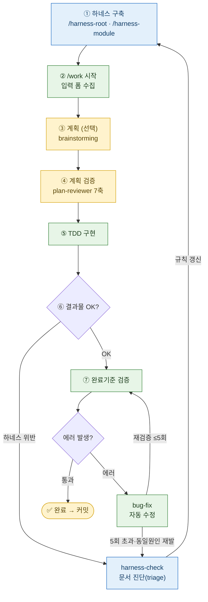

# yeoboya-workflow-v2

앱팀(Android / iOS) 공통 **harness-engineering** 워크플로우 플러그인 V2.
계획 → TDD → 검증 → bug-fix 로 이어지는 **닫힌 루프**를 구성하고, 하네스 문서(규칙)로 Claude Code 에 프로젝트 그래프를 제공한다.

## 설계 원칙 (V2)
1. **한 스킬 = 한 파일.** 작은 스킬은 자체완결, 큰 스킬만 `shared/` 1개 참조.
2. **거대 템플릿 금지 (≤50줄).** 긴 예시가 아니라 짧은 스키마.
3. **hook 은 안전장치만.** 검증·테스트·카운터는 스킬 내부에서.
4. **상태를 파일로 영속화.** `.harness/run-{id}.md` 로 세션 간 인수인계.

## 사전 요구
- **`superpowers` 플러그인 (필수)** — `work` 가 `superpowers:brainstorming`(계획), `superpowers:test-driven-development`(TDD) 를 호출한다. 미설치 시 `/work` 의 계획·TDD 단계가 동작하지 않는다.
- **Notion MCP (선택)** — `harness-check` 가 진단을 Notion 에 기록한다. 없으면 `docs/harness-issues/` 로컬 폴백으로 자동 전환된다.
- **호스트 환경** — bash + git. (hook 은 외부 런타임 의존 없음)

## 구성

### Skills (8)
| 스킬 | 역할 |
|------|------|
| `harness-root` | 루트 문서 7종(+UI_GUIDE) 초안 생성 |
| `harness-root-edit` | 루트 문서 인자 대상 편집 |
| `harness-module` | leaf 모듈 CLAUDE.md + MODULE_MAP 병렬 생성 |
| `harness-module-edit` | 모듈 CLAUDE.md 인자 대상 갱신 (decay 진입점) |
| `harness-verify` | root/module 문서 6축 검증 (공용) |
| `harness-check` | 산출물↔하네스 불일치 진단 → Notion 기록 |
| `work` | 닫힌 루프 엔진 (입력→계획→검토→TDD→검증) |
| `bug-fix` | 검증 실패 자동 수정 루프 (최대 5회) |

### Sub-agents (3)
- `harness-read-write` — 코드 읽고 문서 초안 작성 (sonnet)
- `harness-doc-verifier` — 문서 6축 검증 (opus, 대상=문서/생성 후)
- `plan-reviewer` — 계획 7축 검토 (opus, 대상=계획/실행 전)

### Hooks (2, 안전장치만)
- `block-dangerous-command.sh` — 위험 명령 차단 (PreToolUse/Bash)
- `harness-decay-notify.sh` — 문서 decay 알림 (PostToolUse/Bash)

## 사용 Flow

> 닫힌 루프를 실행하게 하여 사용자(사람)의 개입을 최소화 하는 방향으로 사용

**범례** — 🟩 자동 구간 · 🟨 사람 게이트 · 🟦 하네스(규칙) 루프

- **두 개의 닫힌 고리**
  - **바깥 고리(규칙)**: ⑥ 결과물 불만/위반 또는 bug-fix 막힘 → `harness-check` → 규칙 갱신 → **① 하네스 구축으로 복귀**
  - **안쪽 고리(코드)**: ⑦ 완료기준 검증 중 에러 → `bug-fix` → **재검증으로 복귀** (완료기준 명령별 ≤5회)
- **자동 구간(🟩)**: TDD → 완료기준 검증 → bug-fix (핸드오프는 `.harness/logs/*.log` 파일 경유)
- **사람 게이트(🟨)**: 계획 승인 · 결과물 판단 · 커밋/푸시  ※ ③④ 계획·계획검증은 계획 경로일 때만

## 상태 파일
- `.harness/run-{id}.md` — 진행 상태(계획/단계/bug-fix 횟수/완료기준). work 가 생성, bug-fix 가 갱신.
